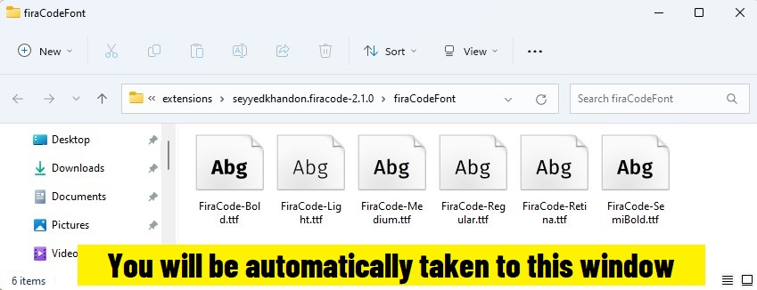

<a href="https://marketplace.visualstudio.com/items?itemName=SeyyedKhandon.tpack">
  
</a>

# One Dark Pro++ - Theme Extension Pack (TPack)

#### VSCode `Icon`/`Theme`/`Font` pack. See [One-Click Setup](#pre-defined-settings-which-you-maybe-want-to-use)


#### Final Step



When the **Font Directory** appears, install fonts if you haven't already, and restart VSCODE once you have.

**Note:** this is because of `OS` limitations, the fonts must be installed manually.

### Available Commands

- `Activate One Dark Pro++ (TPack) Config`
- `Deactivate One Dark Pro++ (TPack) Config`
- `Reset One Dark Pro++ (TPack) Config`

**Note:** to run commands, press `ctrl+shift+p` to open the command palette, and then type each one and click on it.

<details>
<summary>
<i>Here are the configurations this plugin will use</i>
</summary>

```json
{
  "workbench.colorTheme": "One Dark Pro",
  "workbench.iconTheme": "material-icon-theme",
  "editor.fontFamily": "Fira Code",
  "editor.fontLigatures": true
}
```

</details>

## Extensions Included

- 1- [One Dark Pro](https://marketplace.visualstudio.com/items?itemName=zhuangtongfa.Material-theme) - Atom's iconic One Dark theme for Visual Studio Code

- 2- [Material Icon Theme](https://marketplace.visualstudio.com/items?itemName=PKief.material-icon-theme) - Material Design Icons for Visual Studio Code

- 3- [FiraCode Font](https://marketplace.visualstudio.com/items?itemName=SeyyedKhandon.firacode) - Professional Font for Developers

## Recommended Extension pack

<a href="https://marketplace.visualstudio.com/items?itemName=SeyyedKhandon.zpack">
  
</a>

[ZPack](https://marketplace.visualstudio.com/items?itemName=SeyyedKhandon.zpack) is An Opinionated collection of the `best` and `most` used extensions for Web Developers in VSCode which has Better `Developer Experience(DX)` and `load time` in Mind.

## Relevant Links

- [Github](https://github.com/SeyyedKhandon/tpack)
- [VS Code Marketplace](https://marketplace.visualstudio.com/items?itemName=SeyyedKhandon.tpack)

**Enjoy!**
