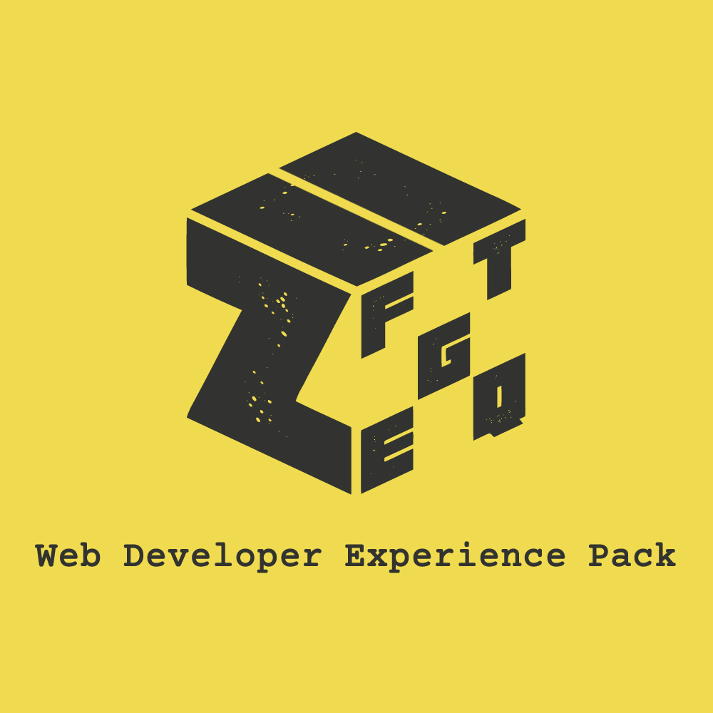

<a href="https://marketplace.visualstudio.com/items?itemName=SeyyedKhandon.tpack">
  
</a>

# One Dark++ Theme Extension Pack (TPack)

#### VSCode `Icon`/`Theme`/`Font` pack. See [One-Click Setup](#pre-defined-settings-which-you-maybe-want-to-use)


## 1-Click Setup:

1. Press `ctrl+shift+p`
2. Type `tpack` or `update config`
3. Click on `Update Theme Pack Extension (TPack) Config` to automatically add configs to your `VSCode`

<details>
<summary>
<i>Click to see what configs this plugin will use</i>
</summary>

```json
{
  "workbench.colorTheme": "One Dark Pro",
  "workbench.iconTheme": "material-icon-theme",
  "editor.fontFamily": "Fira Code",
  "editor.fontLigatures": true
}
```

</details>

## Extensions Included

- 1- [One Dark Pro](https://marketplace.visualstudio.com/items?itemName=zhuangtongfa.Material-theme) - Atom's iconic One Dark theme for Visual Studio Code

- 2- [Material Icon Theme](https://marketplace.visualstudio.com/items?itemName=PKief.material-icon-theme) - Material Design Icons for Visual Studio Code

- 3- [FiraCode](https://github.com/tonsky/FiraCode) - Professional Font for Developers

## Recommended Extension pack

<a href="https://marketplace.visualstudio.com/items?itemName=SeyyedKhandon.zpack">
  
</a>

[ZPack](https://marketplace.visualstudio.com/items?itemName=SeyyedKhandon.zpack) is An Opinionated collection of the `best` and `most` used extensions for Web Developers in VSCode which has Better `Developer Experience(DX)` and `load time` in Mind.

## Relevant Links

- [Github](https://github.com/SeyyedKhandon/tpack)
- [VS Code Marketplace](https://marketplace.visualstudio.com/items?itemName=SeyyedKhandon.tpack)

**Enjoy!**
